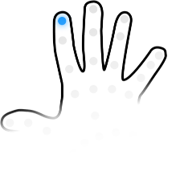
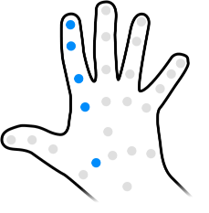
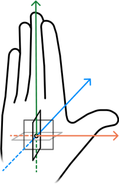
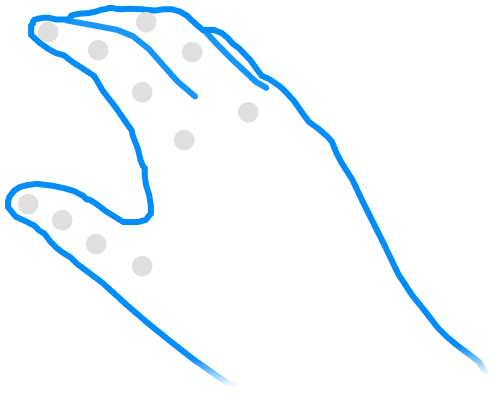
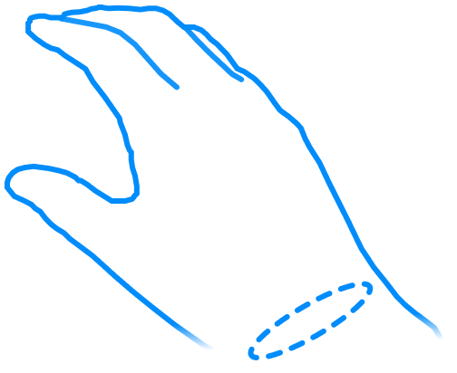
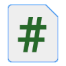

# Gesture building blocks

You can define custom gestures using a set of building blocks:

|     | Building block | Description |
| :-: | :------------- | :---------- |
|  | [Joint data](xref:xrhands-data-model) | The positions and orientations of the joints and bones of a hand are the most fundamental building block of a gesture. The gesture recognizer reads this data automatically. You do not need to reference individual joints when defining a custom gesture. Instead, you specify the aspects of the desired finger shape. |
|  | [Finger shape](xref:xrhands-finger-shapes)  | The overall shape of a finger. Finger shape is abstracted into five aspects that you can specify individually:  <ul><li><b>Full Curl</b>: the overall curve of the finger</li><li><b>Base Curl</b>: the bend of the first knuckle</li><li><b>Tip Curl</b>: the curve of the outer bones of the finger (not including the first knuckle, unless the finger is a thumb)</li><li><b>Pinch</b>: how close the finger is to pinching the thumb</li><li><b>Spread</b>: the splay angle between adjacent fingers</li></ul> For example, the **Full Curl** value rates how curved the entire finger must be to perform the gesture, while the **Base Curl** value rates just the bend of the Metacarpophalangeal (MCP) joint. For a gesture to be recognized, the user's hand must be positioned to match the specified shapes of all referenced fingers within the required tolerance settings.   You define shape values and tolerances for one or more fingers in a **Hand Shape** asset.|
|  | [Orientation](xref:xrhands-hand-orientation) | The orientation of the hand compared to one or more selected reference directions. For example, you can specify that the user's hand be faced toward or away from the user by setting the required orientation properties.   You can add one or more orientation conditions to **Hand Pose** assets and **Static Hand Gesture** components.|
|  | [Hand shape](xref:xrhands-hand-shapes) | Defined by the shape values of one or more fingers. For example, the "Spock" hand shape could be defined by setting the necessary **Full Curl** and **Spread** values of each finger.   Add a **Hand Shape** asset to your project with the  menu: **Assets > Create > XR > Hand Interactions > Hand Shape**.|
|  | [Hand pose](xref:xrhands-hand-poses) | A **Hand Shape** combined with an orientation. For example, an open hand facing the user is a different pose than the same hand shape turned away from the user.    Add a **Hand Pose** asset to your project with the  menu: **Assets > Create > XR > Hand Interactions > Hand Pose**.|
|  | [Static Hand Gesture](xref:xrhands-static-gesture-component) component| The component you add to every scene in which you want a specific gesture to be detected. This component references either a **Hand Shape** or a **Hand Pose** asset to define how the user's hand must be held to trigger the gesture. You can also specify additional, target-relative **Orientation** conditions in this component. |

Refer to [Add a custom gesture to a scene](xref:xrhands-define-custom-gesture) for instructions on defining a custom gesture and adding it to a scene.
