# Finger shape

You can describe the way a user must hold an individual finger in a gesture by specifying a required value for one or more aspects of a finger shape.

 *The OpenXR joint data associated with a finger is evaluated to compare how closely the current shape of the finger matches the specified target shape.*

You can specify values for the following shape aspects:

| State | Description |
| :---- | :---------- |
| [Full Curl](#full-curl) | The overall curve of a finger. (A combination of base and tip curl.) |
| [Base Curl](#base-curl)  | The angle between the hand and the base of the finger. |
| [Tip Curl](#tip-curl) | The curve of the outer portions of the finger. |
| [Pinch](#pinch) | Whether the finger is in a pinching posture based on how close the tip of the finger is to the tip of the thumb. |
| [Spread](#spread) | The spread between this finger and the next (moving from thumb to little finger). |

When describing a hand shape, you assign a normalized target value between 0 and 1 to one or more finger shapes. A value of 1 indicates that the specified finger is fully in that shape. For example, if you set Full Curl equal to 1 for a finger, that finger must be fully curled for the custom gesture to be recognized. Conversely, if you set Full Curl equal to 0, then the finger must be straight. You can set multiple shape values for the same finger.

In addition to a normalized target value for a finger shape, you set upper and lower tolerance values. The tolerance specifies how close the current measurement of the shape must be to the target value for the gesture to be recognized. For example, if you set a target value of .75 with an upper and lower tolerance of 0.05, then the gesture can be recognized when the current, measured value is between .65 and .85. Tolerances allow you to make gestures easier to perform as well as accomodate for varying hand geometries and ranges of motions across your user base.

> [!NOTE]
> The thumb has no pinch value. The little finger has no spread value. If you specify values for these in a hand shape, the gesture will never be recognizable.

## Full Curl

Full Curl specifies the overall curve of a finger. The Full Curl value is normalized to a range between 1 (fully flexed) and 0 (fully extended).

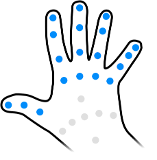  *The joints used to evaluate Full Curl*

Full Curl is based on all of the joints of the finger or thumb. If you need to be more specific when specifying the finger shape for a gesture, you can use  [Base Curl](#base-curl) and [Tip Curl](#tip-curl).

**Full curl examples:**

<table>
    <tr>
        <td>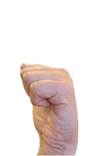</td>
        <td>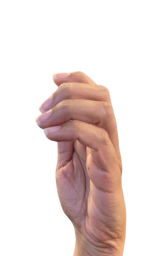</td>
        <td>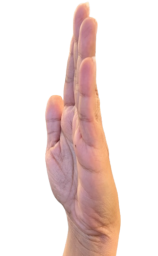</td>
    </tr>
    <tr>
        <td>Fully curled fingers Full Curl == 1.0</td>
        <td>Partially extended fingers Full Curl ~= 0.5</td>
        <td>Fully extended fingers Full Curl == 0</td>
    </tr>
</table>

**Differences between full, tip and base curl:**

Full Curl rates the overall curve of the finger, while Base Curl and Tip Curl rate the curve of the inner and outer parts of the finger. To illustrate the differences between these aspects of finger shape, the following examples show the differences in the normalized values you would expect for different hand shapes:

<table>
    <tr>
        <th><b>Fist</b></th>
        <th><b>Claw</b></th>
        <th><b>Shelf</b></th>
    </tr>
    <tr>
        <td></td>
        <td>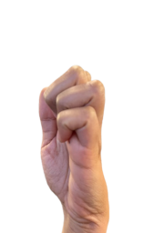</td>
        <td>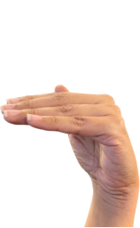</td>
    </tr>
    <tr>
        <td>Full Curl == 1.0</td>
        <td>Full Curl ~= 0.5</td>
        <td>Full Curl ~= 0.5</td>
    </tr>
    <tr>
        <td>Base Curl == 1.0</td>
        <td>Base Curl == 0</td>
        <td>Base Curl == 1.0</td>
    </tr>
    <tr>
        <td>Tip Curl == 1.0</td>
        <td>Tip Curl == 1.0</td>
        <td>Tip Curl == 0</td>
    </tr>
</table>

Full Curl is calculated by averaging normalized angles at each of the three joints in the finger.

Full Curl for the thumb is calculated slightly differently. The same value is report as with [Tip Curl](#tip-curl), since there are only those last two angles instead.

Curl is calculated by averaging the angles of one or more joints of the finger. The difference between the three curl values is which joints are included. The angles are normalized to the range 0..1 based on predefined minimum and maximum angles. These minimum and maximum values are defined by `XRFingerShapeConfiguration`, and can be different between platforms. (You should never need to interact with `XRFingerShapeConfiguration` directly.)

## Base Curl

Base Curl specifies the bend between the finger and the hand. The Base Curl value is normalized to a range between 0 (straight) and 1 (bent at a right angle).

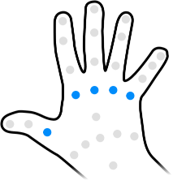  *The joints used for Base Curl*

Base Curl is based solely on the knuckle at the base of the finger between the metacarpal bone and the proximal phalange (the metacarpophalangeal joint).

**Base curl examples:**

<table>
    <tr>
        <td></td>
        <td>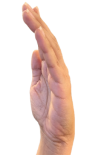</td>
        <td></td>
    </tr>
    <tr>
        <td>Unbent knuckle Base Curl == 0</td>
        <td>Partially bent knuckle Base Curl ~= 0.5</td>
        <td>Fully bent knuckle Base Curl == 1.0</td>
    </tr>
</table>

> [!NOTE]
> The Base and Tip Curl ranges of motion overlap with that of the Full Curl shape. For many gestures, it is typically easier to use the Full Curl value. However, Base and Tip Curl are available when you need more detailed control of the finger shape to properly define a gesture.

Base Curl is calculated as a normalized angle (between 0 and 1). A straight, extended finger would have a Base Curl of 0.0, while a fully bent finger would have a Base Curl of 1.0. The angle we find is between the vectors leading from the central joint of the three that define the angle.

Base Curl for the thumb is still a normalized angle, but it is calculated differently than that of the other fingers. To illustrate, picture the wrist oriented so that it points forward along the z-axis. The base curl for the thumb corresponds to the vertical component of the angle between the thumb and index finger, similar to how [Spread](#spread) is the horizontal component of that angle.

## Tip Curl

Tip Curl specifies how much the outer joints of a finger or thumb are bent. The Tip Curl value is normalized to a range between 1 (fully curled or bent) and 0 (straight).

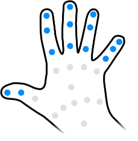  *The joints used for Tip Curl*

Tip Curl is based on the outer joints of the finger and does not include the metacarpophalangeal (MCP) joint between the metacarpal and the first phalange bone. For a finger, the last two joints, those between the three phalange bones, are used when measuring Tip Curl. Since the thumb only has two phalanges, only the single joint between them is used.

**Tip curl examples:**

<table>
    <tr>
        <td></td>
        <td>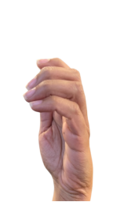</td>
        <td></td>
    </tr>
    <tr>
        <td>Uncurled finger tips Tip Curl == 0</td>
        <td>Partially curled finger tips Tip Curl ~= 0.5</td>
        <td>Maximally curled finger tips Tip Curl == 1.0</td>
    </tr>
</table>

> [!NOTE]
> The Base and Tip Curl ranges of motion overlap with that of the Full Curl shape. For many gestures, it is typically easier to use the Full Curl value. However, Base and Tip Curl are available when you need more detailed control of the finger shape to properly define a gesture.

Full Curl is calculated by averaging normalized angles at each of the last two joints in the finger (or both joints of the thumb).

## Pinch

Pinch specifies how close a finger tip is to pinching the tip of the thumb. The Pinch value is normalized to a range between 1 (touching the tip of the thumb) and 0 (not pinching).

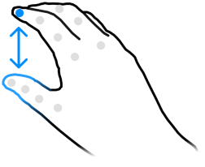  *The Pinch shape*

The thumb has no pinch value. If you specify a pinch value for the thumb in a hand shape, it is ignored.

**Pinch examples:**

<table>
    <tr>
        <td>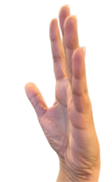</td>
        <td>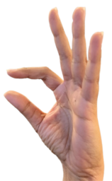</td>
        <td>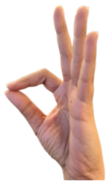</td>
    </tr>
    <tr>
        <td>Not pinching Pinch == 0</td>
        <td>Partial pinch of the index finger Pinch ~= 0.5</td>
        <td>Full pinch of the index finger Pinch == 1.0</td>
    </tr>
</table>

> [!TIP]
> Pinch is a common gesture supported natively by many XR platforms and often used as part of system gestures. As such, you should exercise additional care when creating custom values that involve high pinch values to avoid duplicate gesture detection and conflicts with system gestures.

Pinch is calculated as a linear interpolation between maximum and minimum distances for the finger, as defined by the ranges in `XRFingerShapeConfiguration`. If the distance between finger tip and thumb tip is greater than the maximum distance, the pinch strength is 0. If the distance between those two tips is lower than the minimum, the pinch strength is 1. Anything in between is linearly interpolated.

## Spread

Spread specifies the angle between adjacent fingers. The Spread value is normalized to a range between 0 (fingers roughly parallel) and 1 (maximum angle between the two fingers). The maximum angle is based on the typical range of motion between different fingers.

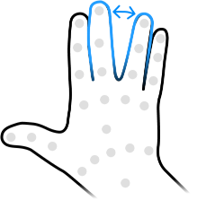  *The Spread angle between two fingers*

Spread measures the angle between a finger and the next finger closer to the little finger (in other words, toward the ulnar, or medial, side of the hand). For example, Spread of the index finger is the angle between the index and middle fingers. The little, or pinky, finger has no Spread value. If you specify a Spread value for the little finger in a hand shape, it is ignored.

**Spread examples:**

<table>
    <tr>
        <td>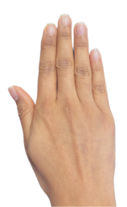</td>
        <td>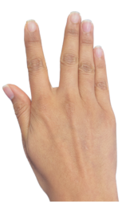</td>
        <td>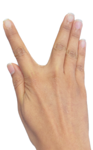</td>
    </tr>
    <tr>
        <td>No index finger Spread Index Spread == 0</td>
        <td>Midway index finger spread Index Spread ~= 0.5</td>
        <td>Full index finger Spread Index Spread == 1.0</td>
    </tr>
</table>

If you were to orient the wrist such that it points along the z-axis, spread is calculated as the normalized horizontal angle between two fingers. The angle is normalized according to ranges defined in `XRFingerShapeConfiguration`. The vectors that define the angle that gets normalized are the proximal to intermediate joints of each finger - this is different for the thumb, which behaves the most consistently by using the index finger's metacarpal and proximal joints, and the thumbs's metacarpal and tip. If the fingers cross or start to cross, a spread value of 0 is reported, because spread represents the convergence, not the divergence, between these vectors.
