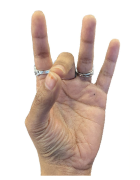
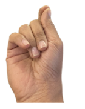

# Gesture design

**What is a gesture?**

In everyday life, gestures are defined as the movement, position or shape of your hands that convey a meaning, emotion, intention etc.
In mixed reality, sensors on headsets have the ability to detect the motion, position and rotation of your hands. This detected data can then be used to configure in the system as an intent. For example, a hand making the shape of “grabbing” an object action can be used to actually grab virtual objects.

Currently, Unity offers recognition of simple but frequently used gestures like pinch, poke, grab/grip and point through the Meta Aim feature but now you can create your own custom gestures using our authoring tool.

## Benefits of creating custom gestures

**Authenticity and Immersion**

Adding custom gestures helps you create input methods that feel true to your storyline and context adding to the immersiveness. For example, if you’re creating an experience with a Hunger Games theme, you can create the district 12 salute as your own way to say hello to fellow players.

**Controller-less interactions**

Custom gesture can help provide an additional way for the user to do tasks without requiring a controller or voice commands like:

* Capturing a photo
* Moving or Teleporting in VR
* Triggering social emoticons in multi-user experiences

**Accessibility**

Based on your audience, you can create custom gestures to make interactions feel more comfortable. For example, an experience targeting a new-to-XR demographic can incorporate familiar yet non-standard XR gestures like a swipe.

## Challenges of using custom gestures

**Learnability of complex gestures**

Some new hand gestures can be hard to teach without adequate guidance like visual cues, tooltips etc. Refer to the design considerations for tips about solving such challenges.

**Trackability of gestures**

Using the current technology, the visibility of joints and fingers by the tracking sensors determines how well it is recognized, which means that if the system can’t see the fingers, that might not guarantee the tracking of those fingers.
For example, if you do the peace sign facing towards the face, the tracking is very good. If the peace sign faces away from the face, the curled fingers are not seen and thereby the tracking is compromised.
Use the gesture debugging tool to see how your authored gesture is performing.

**Difficult to do gestures**

Certain gestures like the Spock sign are near to impossible to perform for some people due to natural variations in the hand skeleton or injuries and impairments. Be sure to test the custom gesture to accommodate most people from your target audience.

**Hard to remember gestures**

Certain gestures can be hard to recall especially when used sparingly.

What you can do: Create a gesture that already has an association with the intended action, for example, using 2 hand frame for capture or add easy to access tooltips to remind the users midway.

**Conflicting gestures**

Most commonly used hand gestures are poke, pinch and grab. If your custom gesture has a hand shape that is tracked as very similar to either of these, there will be false positives and accidental triggers.

What you can do: Use the gesture debugging tool to compare the tracked values with your configured target and tolerance and test the same gesture with diverse users from your target audience.

**Hand fatigue**

Some gestures require more effort than others. If your experience relies solely on hand tracking, be sure to use gestures that expend more energy only sparingly.

**Heuristic based gestures**

Our custom gesture model differs from the commonly provided out-of-box gestures like a poke and pinch, which are usually trained using a wide variety of hand skeletons. Instead, our model relies on the target and tolerance values that you configure for recognition. However, this means that some gestures may not perform as well if you don't account for different hand skeleton constraints during their authoring.

## Considerations for designing custom gestures

**Learnability of complex gestures**

Some new hand gestures can be hard to teach without adequate guidance. You can improve the user's ability to recall a gesture with the following:

* **Visual cues**: Use a visual cue like an illustrated diagram or an animated 3d hand to clearly explain how to do the gesture. Be sure to show the hand at the handle that clearly shows the important finger states like curl, spread of fingers etc.
* **Tooltips**: Add a way for users to quickly replay the visual cues to refresh their memory.
* **Use recognizable gestures**: When possible, use gestures from everyday life for similar interactions like a thumbs up, thumbs down for yes and no actions or a wave for opening a chat window
* **Design easy to recall rules**: Design a set of rules with a simple, easy to remember logic to categorize different types of gestures.

   For example, one such rule might be that any gesture that involves the wrist pointing up is a menu gesture:
   <table>
     <tr>
        <td colspan="2">Wrist facing up and pinch for menu gestures</td>
     </tr>
     <tr>
        <td></d>
        <td></d>
     </tr>
     <tr>
       <td>Thumb and Middle finger pinch spawn the app eye calibration menu</td>
       <td>Thumb and Index finger pinch spawn the app main menu</td>
     </tr>
   </table>

**Placement of hand-coupled UI elements**

If you’re coupling a UI element with the gesture, consider the placement of the UI carefully. Placement position will contribute to effectiveness of the gesture as overlapping of joints will cause the tracking to get compromised.

UI placement to avoid:

| Position | Reson to avoid |
| :-- | :-- |
| On top of the arm | Requires holding out the arm in an awkward angle and height for comfortable pressing of buttons which can cause fatigue over time. |
| Above fingers | Hand fatigue because of holding out hand for a long time. |
| At the bottom of the fingers | Gap between fingers is not enough to prevent accidental clicks. |
| On the palm | Overlapping joints caused tracking issues. |

**Accessibility**

Keep in mind that both hands are not always available. If you’re designing a bimanual gesture:

* Create a single handed fall back gesture
* Add a UI to the scene that can do the same thing, uncoupling hand-locked menus to world-locked.

**Showing gesture system status**

Show feedback for different interaction states on the virtual hands like:

* Glowing fingertips when hands are close to an interactable objects
* Feedback on the virtual hand mesh like turning the virtual hands red when hand tracking is lost

**Designing a flexible experience to account for different situations**

* If your app or experience is completely hand-tracking based, add at least one additional input method like a controller button, voice or eye gaze for the most important actions like closing an experience.
* Consider adding fall back options like using the controller and adding UI to the scene that can do the same thing.
* Allow uncoupling hand-locked menus to be placed in the world to give users more flexibility

**Preventing hand fatigue**

Consider the effort required for performing the gesture to it’s usage ratio i.e if the gesture is used very often, design it to be low effort to perform like a poke or a pinch. User higher effort gestures like a grab, shaka sign or raising a hand sparingly to avoid fatigue.

**Conflicting gestures**

Most commonly used hand gestures are poke, pinch and grab. If your custom gesture has a hand shape that is tracked as very similar to either of these, there will be false positives and accidental triggers.

What you can do: Use the gesture debugging tool to compare the tracked values with your configured target and tolerance and test the same gesture with diverse users from your target audience.

**Designing reliable gestures**

Avoid gestures that naturally require users to take their hands out of the tracking field like an overhand ball throw
Use the debugging tool to set enough tolerance values to account for different types of users from your target audience.

**Consider hand dominance**

Certain gestures are easier to do with the dominant hand. Gestures that use a curl or splay usually require a higher tolerance on the non-dominant hand.

**Social, Cultural and Political implications**

If your app or experience is designed to be used in public, keep in mind that users may find some gestures embarrassing or awkward to do. Also be sure to not use gestures that may be culturally and politically offensive.
