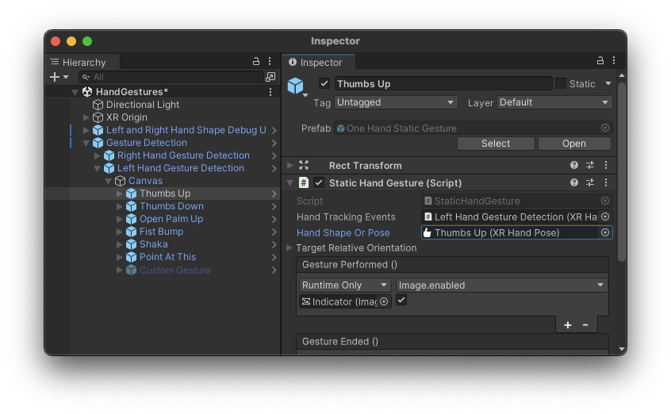
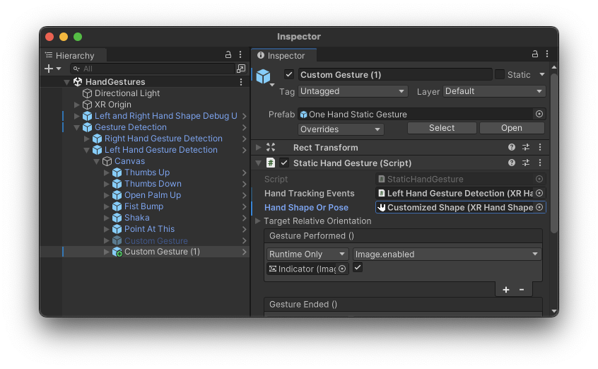

# Customize the gesture debugger scene

The gesture debugger scene shows two different types of data. The finger data graphs show the target values and tolerances for one configured HandShape asset (as well as showing the current measured values). You can edit the scene to [configure the hand shape](#set-hand-shape) so that the finger graphs show the settings of the gesture you are testing.

The gesture detection area shows a list of gestures for each hand. At runtime, the GameObjects for these gestures change color when the associated gesture is detected. You can edit the scene to [add your own gestures](#gestures) to the list.

> [!TIP]
> You must have already imported the Hand Gesture sample from the XR Hands Package. Refer to [Install the gesture debugger](xref:xrhands-install-gesture-visualizer) for instructions.

## Add your own gestures

The gesture detector section of the debug visualizer scene contains a set of GameObjects, each configured to detect one of the sample gestures. You can change which gestures are detected, as well as add additional gestures to list.

### To change one of the configured gestures:

1. Open the HandGestures scene in the Unity Editor.
2. In the **Hierarchy** window, expand the **Gesture Detection** prefab to see it's child objects.
3. Expand the **UI Canvas** gameobject to see the left and right detection prefabs.
4. Expand the **Right** or **Left Hand Gesture Detection** prefab to see the list of prefabs for the detected gestures.
5. Select the prefab for the gesture that you want to change.

   

6. Assign the new HandShape or HandPose asset to the **Hand Shape Or Pose** property of the **Static Hand Gesture** component.
7. If the gesture requires a target relative orientation, edit the **Target Relative Orientation** properties of the **Static Hand Gesture** component.

### To add an additional gesture:

1. Open the HandGestures scene in the Unity Editor.
2. In the **Hierarchy** window, expand the **Gesture Detection** prefab to see it's child objects.
3. Expand the **UI Canvas** gameobject to see the left and right detection prefabs.
4. Expand the **Right** or **Left Hand Gesture Detection** prefab to see the list of prefabs for the detected gestures.
5. Depending on which hand you are adding a gesture to, duplicate the **Left Custom Gesture** or **Right Custom Gesture** prefab (which are in a disabled states).
6. Select the duplicated prefab.

   

7. **Enable** the prefab with the checkbox next to the GameObject name in the Inspector window.
8. Assign the new HandShape or HandPose asset to the **Hand Shape Or Pose** property of the **Static Hand Gesture** component.
9. If the gesture requires a target relative orientation, edit the **Target Relative Orientation** properties of the **Static Hand Gesture** component.
10. Locate the **Text** GameObject under the hierarchy of your new gesture detecter object and assign a meaningful name in the text component.
11. Assign your HandShape and HandPose assets to the right side missing rererences in the two **Gesture Performed** events.
