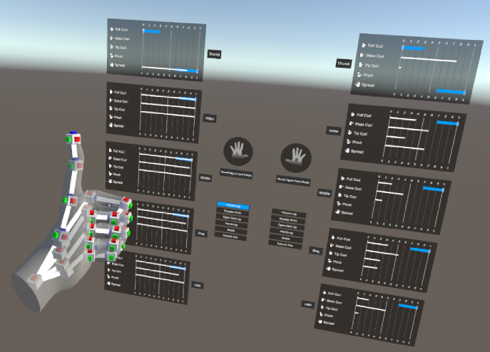
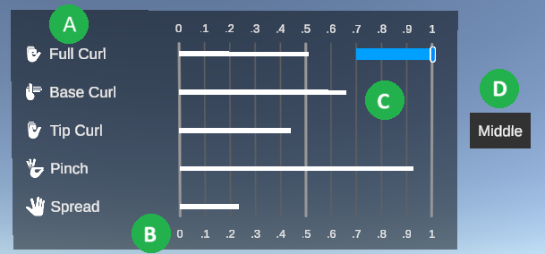
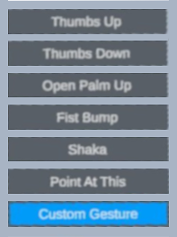

# Understand the gesture debugger

The gesture debugging scene shows two types of information:

* The Handshape Debug Panel displays the current values of the finger shapes for every finger. This display includes the target value and tolerance ranges for the configured hand shape. You can [change the configured hand shape](xref:xrhands-customize-gesture-visualizer#set-hand-shape) so that the values for the selected hand shape you are testing or debugging are shown in the finger graphs for the given hand.
* The Handpose Detection Panel shows whether specific gestures are currently recognized. You can [replace or add to](xref:xrhands-customize-gesture-visualizer#gestures) the list of recognized gestures by editing the scene.

The gesture visualizer is a Unity scene provided as part of the Gestures Sample that you can import from the XR Hands package. Refer to [Install the gesture debugger](xref:xrhands-install-gesture-visualizer) for instructions.

## Handshape Debug Panel
 <i>The gesture debugger scene visualizing a gesture</i>

In order to utilize the Handshape Detection Panel, in the HandGestures scene, enable the "Left and Right Hand Shape Debug UI" prefab, and disable the "Gesture Detection" prefab.

## Handshape Debug Panel : Finger data display

The finger data display shows the current value for each aspect of a finger's shape. For the configured HandShape asset, the display also shows the target value and (upper & lower) tolerance range for each aspect. You can change the configured HandShape asset by editing the visualizer scene. Refer to [Set the HandShape](xref:xrhands-customize-gesture-visualizer#set-hand-shape) for more information.

 *An example of the data displayed for a finger state*

The following table describes each part of the data graph:

|     | Description |
| :-- | :---------- |
| A | The names of the shape values. |
| B | The numeric scale, which is a normalized range between zero and one. |
| C | The finger shape data:  <ul><li><b>White line</b>: The current value of the shape based on the incoming joint data from the hand tracking system.</li><li><b>Marker</b>: The target value of the configured HandShape asset.</li><li><b>Green or Red line</b>: The (upper & lower) tolerance range around the target value.  The line will be green when the current fingerstate value is within the tolerance range, and red when the value is not.</li></ul> |
| D | The name of the finger. |

Refer to [Finger shapes](xref:xrhands-finger-shapes) for information about the shape values. Refer to [Hand shapes](xref:xrhands-hand-shapes) for information about creating and editing HandShape assets.

## Handpose Detection Panel : Gesture detection

In order to utilize the Handpose Detection Panel, in the HandGestures scene, enable the "Gesture Detection" prefab, and disable the "Left and Right Hand Shape Debug UI" prefab.

The gesture detection section of the gesture visualizer provides indicators that change color when one of the configured gestures is detected. You can change the configured gestures or add to the list by editing the visualizer scene. Refer to [Edit the gesture list](xref:xrhands-customize-gesture-visualizer#gestures) for more information.

 <i>The preconfigured sample gestures provided by the XR Hands sample</i>

> [!TIP]
> To see the target values and tolerances for a gesture's finger shapes, you can [edit the scene](xref:xrhands-customize-gesture-visualizer#set-hand-shape) so that the finger data display references the same HandShape asset as the gesture you are interested in.
