# Hand orientation

Hand orientation is the rotation of the hand relative to a user or an object in the scene.

To define a hand orientation, you choose an axis of the hand, a reference direction to compare it to, and how the two directions must be aligned. These properties are described in the following sections:

* [Hand axis](#hand-axis): a direction relative to the hand
* [Reference direction](#reference-direction): a direction relative to the user, another object, or the XR Origin.
* [Alignment](#alignment): how the two directions must be aligned.

When you define a custom gesture, you can specify whether the hand must be in a particular orientation in either a [Hand Pose](xref:xrhands-hand-poses) asset or a [Static Hand Gesture](xref:xrhands-static-gesture-component) component. The difference is that you can only specify target-relative reference directions in a static hand gesture component (because you need a reference to a GameObject in the scene to set a target).

## Hand axis

For specifying an orientation, the axes of the hand are defined relative to the extended fingers, extended thumb, and the palm of the hand.

<table style="table-layout: fixed;">
    <tr>
        <th>Fingers Extended Direction</th>
        <th>Thumb Extended Direction</th>
        <th>Palm Direction</th>
    </tr>
    <tr>
        <td>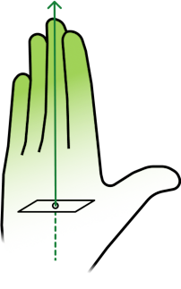</td>
        <td>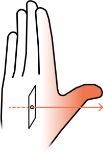</td>
        <td>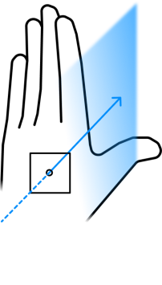</td>
    </tr>
    <tr>
        <td>This hand axis points in the same direction as the fully extended fingers (along the proximal-distal line of the hand).</td>
        <td>
            
This hand axis points in the same direction as the fully extended thumb (along the radial-ulnar -- also known as medial-lateral -- line of the hand).

            
The thumb extended direction is always referenced to the thumb, so it points the opposite direction on the left hand compared to the right hand. However, this allows you to use the same hand poses for both hands.

        </td>
        <td>This hand axis points in the direction the palm is facing (along the palmar-dorsal line of the hand).</td>
    </tr>
</table>

## Reference direction

The reference direction is the direction to which to compare the chosen axis of the hand when determining if the hand is in the desired orientation to recognize a gesture. For example, if your gesture requires that the user's palm faces the user, then you could choose the **Palm Direction** as the hand axis and **Hand to head** as the reference direction (and set the other orientation properties as appropriate).

There are two different contexts in which you might specify a reference direction for a gesture. In a [Hand Pose](xref:xrhands-hand-poses) asset, you can specify a direction relative to either the XR Origin or the user. In a [Static Hand Gesture](xref:xrhands-static-gesture-component) component, you can specify a direction relative to a target GameObject in the same scene as the component.

In a hand pose, you can choose one of the following user-relative reference directions:

* [Origin up](#origin-up): the direction of the positive y axis of the XR Origin.
* [Hand to Head](#hand-to-head): the direction from the hand toward the user's head.
* [Nose Direction](#head-axis): the direction in which the user's face is pointing.
* [Chin Direction](#head-axis): the direction toward the bottom of the user's head.
* [Ear Direction](#head-axis): the direction pointing out of the user's ear (the left ear for left-handed gestures and the right ear for right-handed gestures).

In a static hand gesture component, you can specify one of the following target-relative reference directions:

* [Hand to Target](#hand-to-target): the direction from the hand toward the target.
* [Target Forward](#target-axis): the direction along the target's local positive Z axis.
* [Target Up](#target-axis): the direction along the target's local positive Y axis.
* [Target Right](#target-axis): the direction along the target's local positive X axis.

### Origin up

The positive Y axis of the XR Origin in a scene. Typically this is the same as the scene origin's positive Y axis and the user's physical up direction.

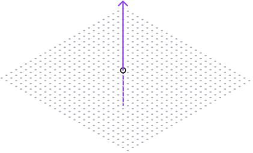

Every XR scene has an XR Origin object that established the center of tracking space. When you use this reference direction, the gesture detection code can implicitly find the XR Origin without needing a hard reference to the object.

### Hand to Head

A direction pointing from the palm point of the hand toward the center of the user's head.

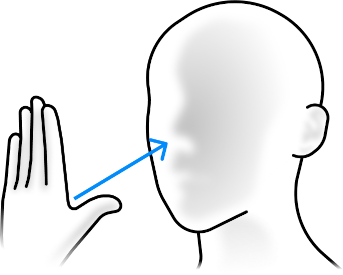

### Head axis

For specifying an orientation, the axes of the head are defined relative to the face.

<table style="table-layout: fixed;">
    <tr>
        <th>Chin Direction</th>
        <th>Ear Direction</th>
        <th>Nose Direction</th>
    </tr>
    <tr>
        <td>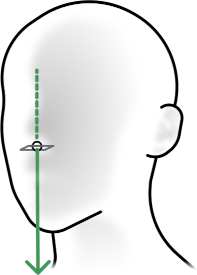</td>
        <td></td>
        <td>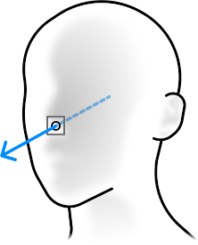</td>
    </tr>
    <tr>
        <td>A direction pointing along the head's local Y axis or downward direction.</td>
        <td>
            
A direction pointing along the head's local X axis.

            
This direction points out of the left ear for gestures of the left hand and out of the right ear for gestures of the right hand.

        </td>
        <td>A direction pointing along the head's local Z axis or forward direction.</td>
    </tr>
</table>

### Hand to Target

A direction pointing from the palm point of the hand to the position of a target GameObject's Transform in a scene.

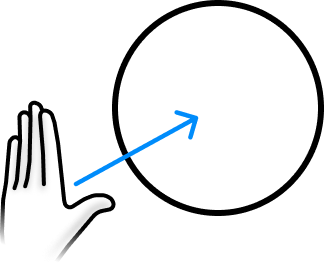

### Target axis

Target orientations use the local axis of the target GameObject's transform.

<table style="table-layout: fixed;">
    <tr>
        <th>Target Up</th>
        <th>Target Right</th>
        <th>Target Forward</th>
    </tr>
    <tr>
        <td>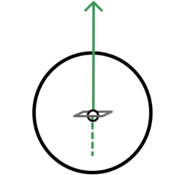</td>
        <td>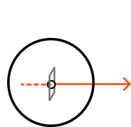</td>
        <td>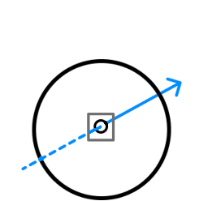</td>
    </tr>
    <tr>
        <td>A direction pointing along a target's local Y axis.</td>
        <td>A direction pointing along a target's local X axis.</td>
        <td>A direction pointing along a target's local Z axis.</td>
    </tr>
</table>

## Alignment

You can choose from the following types of alignement to use when comparing a hand axis to a reference direction:

* **Aligns With**: Both directions must point in the same direction.
* **Perpendicular to**: The hand axis must be perpendicular to the reference direction.
* **Opposite To**: The hand axis must be parallel to the reference direction, but pointing in the opposite direction.

When specifying an orientation, you can set the **Angle Tolerance** to a value between 0.1 and 180 degrees. The two directions must be within that many degrees of each other using the chosen alignment type in order for the gesture to be recognized.

You can also choose to ignore the Y component when comparing alignment between the hand and the **Hand to Head** or **Hand to Target** reference directions. This option effectively projects the chosen hand axis and reference directions onto the X-Z plane (through the origin). For example, you could use this option so that the user only needs to point in the general, compass direction of a target object to perform a gesture, rather than directly at it.

### Alignment examples

The following examples illustrate how the different alignment options affect the comparison of a hand axis to a reference direction:

<table>
    <tr><td></td><td colspan="3"><b>Palm Direction</b></td></tr>
    <tr>
        <td><b>Origin Up</b></td>
        <td>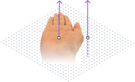</td>
        <td>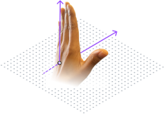</td>
        <td>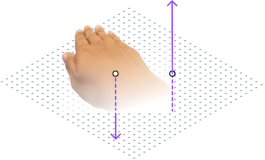</td>
    </tr>
    <tr>
        <td><b>Target Up</b></td>
        <td>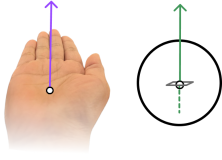</td>
        <td>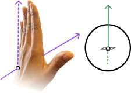</td>
        <td>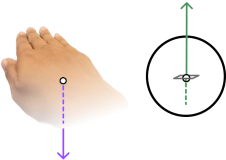</td>
    </tr>
    <tr>
        <td></td>
        <td><b>Aligns With</b></td>
        <td><b>Perpendicular To</b></td>
        <td><b>Opposite To</b></td>
    </tr>
</table>
