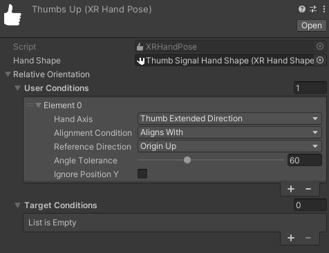
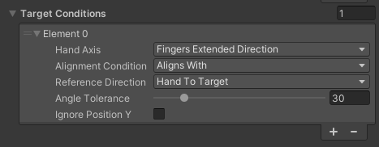

# Hand pose

A hand pose adds a user-relative orientation to a [hand shape](xref:xrhands-hand-shapes).

You can reference either a hand pose or a hand shape in a [Static Hand Gesture](xref:xrhands-static-gesture-component) component. The difference is that with a hand shape, the gesture is recognized no matter how the user's hand is oriented (assuming the finger shape conditions all pass). With a hand pose, you can specify that the hand must also be oriented in a specific way relative to the user or the XR Origin. For example, to define a "thumb's up" gesture, you could create a hand shape specifying that the thumb is extended and all the other fingers are curled. To ensure that the thumb is pointing up, you would need to reference the hand shape in a hand pose asset and add the proper orientation values. Refer to [Hand Orientation](xref:xrhands-hand-orientation) for more information about specifying an orientation as part of a gesture.

### Create a hand pose asset

Add a new hand pose asset to your project from the Editor **Assets** menu: **Assets > Create > XR > Hand Interactions > Hand Pose** or by right-clicking on a project folder to open the context menu:

1. In the Unity Editor Project panel, right-click the folder in which you want to create the new asset.
2. In the pop-up menu, select the command: **Create > XR > Hand Interactions > Hand Pose**.
   * A **New Hand Pose** asset is created.
3. Assign an appropriate name to the new asset file.
4. Select the asset to view its properties.
5. [Edit the asset](#edit-a-hand-pose) to define your hand pose.

### Edit a hand pose

To edit a hand pose:

1. Select the hand pose asset file in the Editor Project panel.
   * The asset properties are displayed in the Inspector.
2. Choose an **XR Hand Shape** asset for the **Hand Shape property.
   * You can drag an asset to the property or click the object picker button inside the field.
3. Under **Hand Orientation**, use the + button to add one or more **Hand Orientation Conditions** to the pose.
4. Set the properties of each condition to the desired values.

When you reference a hand pose in a gesture component, the user's hand must satisfy both the hand shape conditions and the orientation conditions in order for the gesture to be recognized.

> [!NOTE]
> You can only specify user-relative orientations or the [XR Origin Up axis](xref:xrhands-hand-orientation#origin-up) in a hand pose. For example, you can specify that the palm is facing toward or away from the user, but you cannot specify that the palm is facing another object in a scene. To specify a target-relative orientation for a gesture, you must use the orientation properties of the [XR Static Hand Gesture](xref:xrhands-static-gesture-component) component used to add the gesture to the scene containing the target object.

### XR Hand Pose properties

The **XR Hand Pose** class is a ScriptableObject that you can use to define the hand poses to use with gestures.

   *Hand Pose Inspector example*

The **XR Hand Pose** object has the following properties:

| Property | Description |
| :------- | :---------- |
| **Hand Shape** | The [XRHandShape](xref:xrhands-hand-shapes) asset to use for this pose. |
| **User Conditions** list | A list of user conditions that the gesture must satisfy to be recognized. All orientations in the list must evaluate to true. Refer to [User Relative Conditions](#user-relative-conditions) for more information about the individual properties of a condition. |
| **Target Conditions** | An optional collection of target-relative orientation conditions that must be met for the gesture to be detected. Refer to [Target Relative Orientation](#target-relative-conditions) for information about the properties of the elements of this list. |

### User Relative Conditions

A user relative condition defines the required angular relationship between an axis of the hand and a reference direction. To evaluate to true, the hand axis and the reference direction must be aligned within the number of degrees set by the **Angle Tolerance** property.

| Property | Description |
| :------- | :---------- |
| **Hand Axis** | The [axis of the hand](xref:xrhands-hand-orientation#hand-axis) to compare to the **Reference Direction**. |
| **Alignment Condition**| The desired [alignement](xref:xrhands-hand-orientation#alignment) between the **Hand Axis** and the **Reference Direction**. The options are:<ul><li><b>Aligns With</b>: Parallel and point in the same direction</li><li><b>Perpendicular To</b>: At right angles to each other</li><li><b>Opposite To</b>: Parallel but point in the opposite directions</li></ul> |
| **Reference Direction** | The user-relative direction to compare to the chosen **Hand Axis**. You can also use the [XR Origin Up axis](xref:xrhands-hand-orientation#origin-up) as the reference direction. (Set the orientation condition in a [Static Hand Gesture](xref:xrhands-static-gesture-component) component to specify target-relative conditions.) |
| **Angle Tolerance**| The allowed deviation in degrees between the **Hand Axis** and the **Reference Direction**. |
| **Ignore Position Y** | Enable to ignore the Y values of the hand when determining orientation. |

### Target Relative Conditions

Each element of the **Target Conditions** list defines a condition that the hand must meet in order for the gesture to be detected. The conditions in this list define how the hand must be oriented relative to a target GameObject in the scene. (Use a [Hand Pose](xref:xrhands-hand-poses) asset to define orientation conditions relative to the user or the global Y axis.)

For additional information, including visual examples, about the orientation properties, refer to [Hand orientation](xref:xrhands-hand-orientation).

 *Settings for an element in the Target Conditions list*

| Property | Description |
| :------- | :---------- |
| **Hand Axis** | The [axis of the hand](xref:xrhands-hand-orientation#hand-axis) to compare to the **Reference Direction**. |
| **Alignment Condition** | The desired [alignement](xref:xrhands-hand-orientation#alignment) between the **Hand Axis** and the **Reference Direction**. The options are:<ul><li><b>Aligns With</b>: Parallel and point in the same direction</li><li><b>Perpendicular To</b>: At right angles to each other</li><li><b>Opposite To</b>: Parallel but point in the opposite directions</li></ul>|
| **Reference Direction** | The target relative direction to compare to the chosen **Hand Axis**. |
| **Angle Tolerance** | The allowed deviation in degrees between the **Hand Axis** and the **Reference Direction**. |
| **Ignore Position Y** | Enable to ignore the Y values of the hand and the target object when determining orientation. Only matters when the **Hand To Target** is chosen as the **Reference Direction**. |
