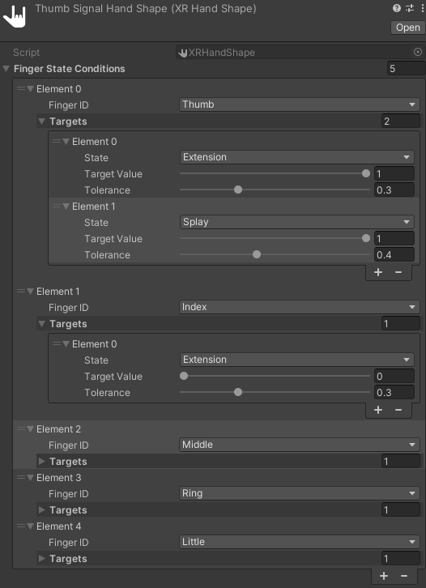

# Hand shape

When defining a custom gesture, you use a hand shape to describe the overall posture that the hand needs to be in to trigger the gesture.

A hand shape is a collection of [finger shapes](xref:xrhands-finger-shapes). For each finger shape that you include, you specify a normalized target value along with a tolerance. For a gesture to be recognized, the user's hand must match each finger shape in the collection within the specified tolerance.

For example, to define the shape of a "peace sign" gesture, you could add a Full Curl shape for all five fingers. You would then set the target value for Full Curl of the index and middle finger to 0, to specify that those fingers must be straight, and the target values of the other fingers to around 1, to specify that they must be fully curled. You can adjust the tolerance values to allow more or less curvature when a user performs the gesture.

Define hand shapes using the [XR Hand Shape ScriptableObject asset](#xr-hand-shape-asset).

You can reference an **XR Hand Shape** asset in an [XR Hand Pose](xref:xrhands-hand-poses) asset or directly in a [Static Hand Gesture](xref:xrhands-static-gesture-component) component. A hand shape asset can be used in more than one pose assets and gesture components. You can use the same hand shape for gestures on either hand.

The samples available in the XR Hands package contain example hand shapes that you can use in your project.

## XR Hand Shape asset

The **XR Hand Hand Shape** asset allows you to define a hand shape as a list of [finger shapes](xref:xrhands-finger-shapes) with corresponding target and tolerance values.

### Create a hand shape asset

Add a new hand shape asset to your project from the Editor **Assets** menu: **Assets > Create > XR > Hand Interactions > Hand Shape** or by right-clicking on a project folder to open the context menu:

1. In the Unity Editor Project panel, right-click the folder in which you want to create the new asset.
2. In the pop-up menu, select the command: **Create > XR > Hand Interactions > Hand Shape**.
   * A **New Hand Shape** asset is created.
3. Assign an appropriate name to the new asset file.
4. Select the asset to view its properties.
5. [Edit the asset](#edit-a-hand-shape) to define your hand shape.

### Edit a hand shape

To edit a hand shape:

1. Select the hand shape asset file in the Editor Project panel.
   * The asset properties are displayed in the Inspector.
2. Add an element to the **Finger State Conditions** list for each finger that you want to include in the shape definition.
   * Click the + and - buttons at the bottom of the **Finger State Conditions** list to add or remove elements.
3. For each element in the list:
   a. Set the **Finger ID** to the desired finger.
   b. Under **Targets** add an element for each finger shape that you want to include in the hand shape.
      * Click the + and - buttons under the **Targets** list to add or remove elements.
   c. Choose the **State** type. Refer to [finger shape](xref:xrhands-finger-shapes) for a description of each type.
   d. Set the **Target Value**.
   e. Set the **Upper Tolerance** and **Lower Tolerance** values.

> [!TIP]
> The conditions and targets in the list are evaluated in order. Evaluation stops as soon as the first value is outside the required tolerance range. You can reorder the elements within both the **Finger State Conditions** list and within each individual **Targets** list.

### XR Hand Shape properties

The **XR Hand Shape** class is a ScriptableObject that you can use to define the hand shapes to use with gestures.

   *Hand Shape Inspector example*

The **XR Hand Shape** object has the following properties:

| Property |     | Description |
| :------- | :-- | :---------- |
| **Finger State Conditions** list|| A reorderable list of finger shapes. Each shape consists of a Finger ID and a list of shapes. Click the + and - buttons to change the number of elements in the list. |
| **Finger ID** || The name of a finger. |
| **Targets** list || The target values of the individual shapes that the fingers must match in order for the gesture to be recognized. |
|| **State** | A [finger shape](xref:xrhands-finger-shapes) type. |
|| **Target Value** | A normalized value between 0 and 1. A value of one means the finger is fully in that shape. For example, for the pinch shape, a value of 1.0 means that the finger tip is touching the tip of the thumb in a pinch posture.|
|| **Tolerance** | How close the current, measured value of the user's finger must be to the specified target value for the condition to evaluate to true. For example, if you set a target of 0.5 and a tolerance of 0.2, then the measured value must be between 0.3 and 0.7 for the gesture to be recognized. Evaluation of a gesture stops at the first member of the conditions list that falls outside the required tolerance. |
