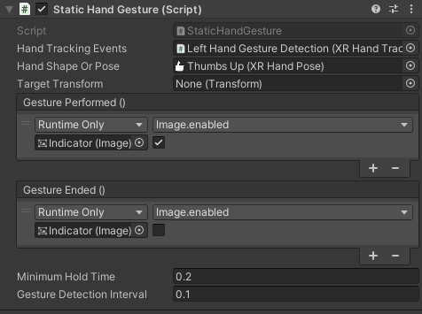

# Static Hand Gesture component

The **Static Hand Gesture** component compares the tracking data for a user's hand to a defined hand shape or pose and dispatches an event when the two match within the specified tolerances.

> [!IMPORTANT]
> You must import the **Gestures** sample provided by the XR Hands package to use the **Static Hand Gesture** component. Refer to [Samples](xref:xrhands-manual#samples) for instructions.

 *Inspector for the Static Hand Gesture component*

| Property | Description |
| :------- | :---------- |
| **Hand Tracking Events** | The [XRHandTrackingEvents](xref:xrhands-access-data) component in the scene that provides hand tracking data. The **Handedness** setting of this component determines the hand for which gestures are detected.|
| **Hand Shape Or Pose**   | A [Hand Shape](xref:xrhands-hand-shapes) or [Hand Pose](xref:xrhands-hand-poses) asset that defines the static hand shape of the gesture. A **Hand Pose** also defines any required user-relative and target-relative [orientation](xref:xrhands-hand-orientation) conditions.|
| **Target Transform** | The Transform component of the target GameObject in the scene. Used for each target-relative condition in the **Hand Shape Or Pose** if it is a **Hand Pose**.|
| **Background** | The image component that draws the background of this gestures's icon.
| **Gesture Performed** event handlers    | The list of handlers for the event dispatched when the gesture is detected. |
| **Gesture Ended** event handlers | The list of handlers for the event dispatched when the gesture stops being detected.|
| **Minimum Hold Time** | The user must hold the gesture for this number of seconds before the gesture performed event is dispatched. A longer hold time can reduce spurious and accidental gesture detections, but also increases the lag between the user performing the gesture and your application reacting to it. |
| **Gesture Detection Interval** | How often the user's hand data is compared to the gesture's specified hand shape and orientation. A longer detection interval decreases the CPU resources spent on gesture detection, but increases detection lag. |
