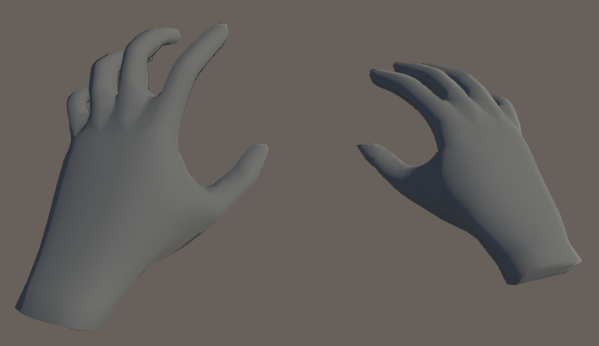
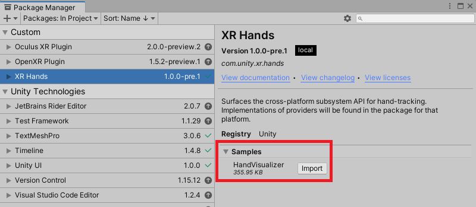

# XR Hands

The XR Hands package defines an API that allows you to access hand tracking data from devices that support hand tracking. To access hand tracking data, you must also enable a provider plug-in that implements the XR hand tracking subsystem. 

 *Hand-tracking*

> [!NOTE]
> If you are implementing hand tracking for a Unity provider plug-in, see [Implement a provider](xref:xrhands-implement-a-provider).

## Supporting packages

The XR Hands package defines the API for hand tracking, but doesn't implement the feature itself. To use hand tracking on a target platform, you also need a separate *provider plug-in* package for that platform that has been updated to provide hand-tracking data to the [XRHandSubsystem](xref:UnityEngine.XR.Hands.XRHandSubsystem), the subsystem which this package defines.

This package will work with OpenXR if the OpenXR package is installed and in use.

To see if other provider plug-in packages you use supports hand tracking, check the documentation for those packages.

> [!NOTE]
> XR Hands will not work on a target platform unless you also install the provider plug-in package for that platform. See [Install XR Hands](xref:xrhands-install) for detailed setup instructions.

## Samples

A visualizer sample is provided that can be imported into your project through the Samples tab of this package's view in the Package Manager window. This sample has a mesh and script that assume OpenXR layout, so it is recommended you either use the OpenXR plug-in or one that conforms to the OpenXR hand joint layout.

 *Import the HandVisualizer sample*
