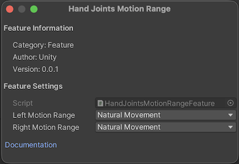

# Hand Joints Motion Range OpenXR feature

The **Hand Joints Motion Range** feature lets you constrain hand joint poses to either the full natural range of hand motion or to motion that conforms to a held controller. This feature enables the [XR_EXT_hand_joints_motion_range](https://registry.khronos.org/OpenXR/specs/1.1/html/xrspec.html#XR_EXT_hand_joints_motion_range) OpenXR extension.

You can set the following options per hand:

  * **Natural Movement**: joint poses reflect the full, unobstructed range of hand motion. This is the default.
  * **Controller-locked**: joint poses conform to a held controller, reflecting how the hand wraps around the device.

You can change the motion range at runtime without recreating the hand tracker, as outlined in [Update the motion range at runtime](#update-the-motion-range-at-runtime).

> [!NOTE]
> **Controller-locked** mode is only effective when the [Hand Tracking Data Source](xref:xrhands-openxr-data-source-feature) feature includes **Controller-driven** as a preferred source.

## Prerequisites

To use the Hand Joints Motion Range feature, your project must meet the following requirements:

* Install the [OpenXR package](https://docs.unity3d.com/Packages/com.unity.xr.openxr@1.18) `1.18.0` or newer.
* Enable the [Hand Tracking Subsystem](xref:xrhands-openxr-hands-feature) feature. A validation rule alerts you if it isn't enabled.

> [!NOTE]
> The **Hand Joints Motion Range** feature requires the target device's runtime to support the `XR_EXT_hand_joints_motion_range` extension. If the runtime doesn't support it, the feature has no effect. Hand tracking continues with the runtime's default joint motion range, and `TryGetConfiguration` / `TryUpdateConfiguration` return `false`.

## Enable Hand Joints Motion Range

To enable the Hand Joints Motion Range feature:

1. Go to **Project Settings** > **XR Plug-in Management** > **OpenXR**.
2. Under **OpenXR Feature Groups**, select the **All Features** feature group.
3. Enable the **Hand Joints Motion Range** OpenXR feature.

## Configure feature settings

To access the **Hand Joints Motion Range** settings, click the gear icon next to **Hand Joints Motion Range** in **Project Settings** > **XR Plug-in Management** > **OpenXR**.

 *Feature settings for Hand Joints Motion Range*

You can choose a motion range per hand:

| Property | Description |
| :------- | :---------- |
| **Left Motion Range** | The motion range constraint for the left hand. Default: **Natural Movement**. |
| **Right Motion Range** | The motion range constraint for the right hand. Default: **Natural Movement**. |

You can choose one of the following motion ranges:

| Option | Description |
| :----- | :---------- |
| **Natural Movement** | Joint poses reflect the full natural range of hand motion. Maps to `XR_HAND_JOINTS_MOTION_RANGE_UNOBSTRUCTED_EXT`. |
| **Controller-locked** | Joint poses conform to the shape of a held controller. Maps to `XR_HAND_JOINTS_MOTION_RANGE_CONFORMING_TO_CONTROLLER_EXT`. |

## Update the motion range at runtime

You can read and update the requested hand joints motion range at runtime through the [XRHandSubsystem](xref:UnityEngine.XR.Hands.XRHandSubsystem) configuration handler API.

### Query the requested configuration

Use [XRHandSubsystem.TryGetConfiguration&lt;HandJointsMotionRangeConfig&gt;](xref:UnityEngine.XR.Hands.XRHandSubsystem.TryGetConfiguration``1(``0@)) to read the requested motion range for each hand:

[!code-cs [get_hand_joints_motion_range_sample](../../DocCodeSamples.Tests/HandJointsMotionRangeSample.cs#get_hand_joints_motion_range_sample)]

### Update the configuration

Use [XRHandSubsystem.TryUpdateConfiguration&lt;HandJointsMotionRangeConfig&gt;](xref:UnityEngine.XR.Hands.XRHandSubsystem.TryUpdateConfiguration``1(``0)) to change the motion range. The update takes effect on the next `xrLocateHandJointsEXT` call:

[!code-cs [update_hand_joints_motion_range_sample](../../DocCodeSamples.Tests/HandJointsMotionRangeSample.cs#update_hand_joints_motion_range_sample)]

The method returns `false` if either value isn't a valid [HandJointsMotionRange](xref:UnityEngine.XR.Hands.OpenXR.HandJointsMotionRange) member or if the internal structure chain isn't available.

## Additional resources

* [Hand tracking feature](xref:xrhands-openxr-hands-feature)
* [Hand Tracking Data Source feature](xref:xrhands-openxr-data-source-feature)
