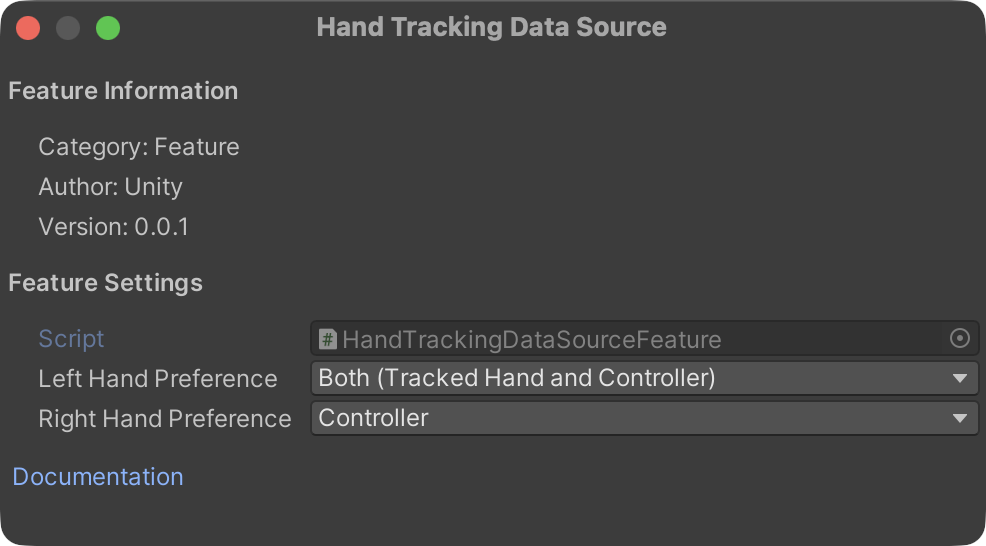

# Hand Tracking Data Source OpenXR feature

The **Hand Tracking Data Source** feature lets you choose which source of data to prefer for hand tracking.

 You can set the following options per hand:

  * **Tracked Hand**: hand data is derived by tracking the hand's joint position and poses are directly, typically using the device's camera.
  * **Controller**: hand data is derived from a hand-held controller. This data source can synthesize multiple inputs, such as optical tracking of the controller along with the controller's Inertial Measurement Unit (IMU), capacitive touch, and similar sensors.
  * **Both**: allows the runtime to choose whether to choose the source of data according to the current conditions.

The data source can change between frames. You can query which source the runtime is actively using with the [XRHandTrackingSubsystem.TryGetExtendedData<HandTrackingDataSource>](xref:UnityEngine.XR.Hands.XRHandSubsystem.TryGetExtendedData``1(UnityEngine.XR.Hands.Handedness,``0@)) method.

This feature enables the [XR_EXT_hand_tracking_data_source](https://registry.khronos.org/OpenXR/specs/1.1/html/xrspec.html#XR_EXT_hand_tracking_data_source) OpenXR extension. The `XR_EXT_hand_tracking_data_source` extension must be supported by the target device for the **Hand Tracking Data Source** feature to work. If the extension is not supported, then the runtime uses its default behavior to select a data source and the `TryGetExtendedData` method always returns `false`.

You must enable the [Hand Tracking Subsystem](xref:xrhands-openxr-hands-feature) feature to use this **Hand Tracking Data Source** feature. A validation rule will alert you if it is not enabled.


## Feature settings
To access the **Hand Tracking Data Source** settings, click the gear icon next to **Hand Tracking Data Source** in **Project Settings > XR Plug-in Management > OpenXR**.

<br/>*Feature settings for Hand Tracking Data Source*

You can choose a preferred data source per hand:
| Property | Description |
| :------- | :---------- |
| **Left Hand Preference** | The preferred data source for the left hand. Default: **Both**. |
| **Right Hand Preference** | The preferred data source for the right hand. Default: **Both**. |

You can choose one of the following data sources:

| Option | Description |
| :----- | :---------- |
| **Tracked Hand** | Optical (camera-based) hand tracking with no controller present. |
| **Controller** | Hand poses derived from a held controller's sensors (e.g., capacitive touch, IMU). |
| **Both** | Accept both optical and controller-derived sources. The runtime chooses the active source based on current conditions. |


> [!NOTE]
> These preferences are sent to the runtime when the hand tracker is created. The runtime uses them as hints but may not honor them if the requested source is unavailable. Use the runtime query API described below to check which source is actually active.

## Query the active data source at runtime

You can query which data source the runtime is using for a given hand each frame through the [XRHandSubsystem.TryGetExtendedData<TData>(Handedness, out TData)](xref:UnityEngine.XR.Hands.XRHandSubsystem.TryGetExtendedData``1(UnityEngine.XR.Hands.Handedness,``0@)):

```csharp
if (subsystem.TryGetExtendedData<HandTrackingDataSource>(Handedness.Left, out HandTrackingDataSource leftSource))
{
    // leftSource is the active data source for the left hand
    Debug.Log($"Left hand source: {leftSource}");
}
```

The method returns `false` if the hand is not currently tracked or the feature is not active.

## Additional resources

* [Hand tracking feature](xref:xrhands-openxr-hands-feature)
* [OpenXR Specification: XR_EXT_hand_tracking_data_source](https://registry.khronos.org/OpenXR/specs/1.1/html/xrspec.html#XR_EXT_hand_tracking_data_source)
