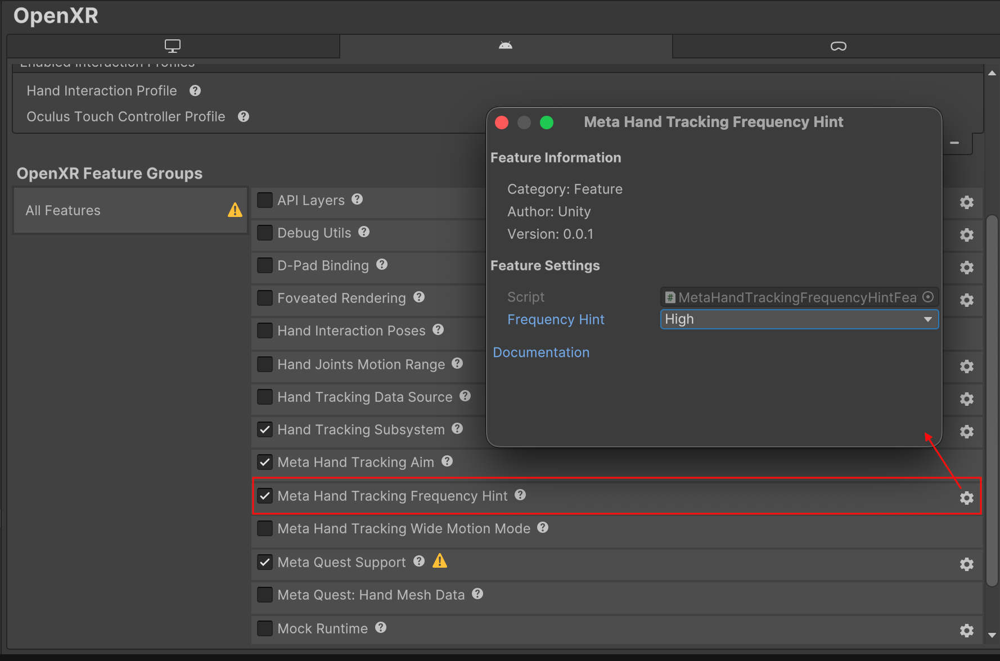

# Meta Hand Tracking Frequency Hint OpenXR feature

Unity OpenXR provides support for the `XR_META_hand_tracking_frequency_hint` extension. This extension augments the `XR_EXT_hand_tracking` extension and allows applications to provide a frequency hint to the runtime to indicate the desired hand tracking update frequency. Applications can suggest that the runtime use a higher tracking frequency when needed for low-latency scenarios, or use the default frequency for normal operation.

> [!NOTE]
> The frequency hint is a suggestion only. The runtime may choose to ignore the hint based on user preferences, system constraints, power management policies, or other considerations. Applications should not rely on the runtime honoring the hint and should be prepared to handle hand tracking data at any supported frequency.

## Prerequisites

To use the Meta Hand Tracking Frequency Hint feature, your project must meet the following requirements:

* Install the [OpenXR package](https://docs.unity3d.com/Packages/com.unity.xr.openxr@1.19) `1.19.0` or newer.
* Enable the [Hand Tracking Subsystem](xref:xrhands-openxr-hands-feature) feature.

## Enable the feature

To enable the Meta Hand Tracking Frequency Hint feature:

1. Go to **Project Settings** > **XR Plug-in Management** > **OpenXR**.
2. Enable **Meta Hand Tracking Frequency Hint** in the feature list.

The [Hand Tracking Subsystem](handtracking.md) feature must also be enabled or the frequency hint feature has no effect.

## Feature settings

| Property | Description |
| :------- | :---------- |
| **Frequency Hint** | The frequency hint to apply when the OpenXR session starts. Can be changed at runtime using [XRHandSubsystem.TryUpdateConfiguration](xref:UnityEngine.XR.Hands.XRHandSubsystem.TryUpdateConfiguration*). |

To access this property, click the gear icon next to **Meta Hand Tracking Frequency Hint** in **Project Settings > XR Plug-in Management > OpenXR**.

<br/>*Feature settings for Meta Hand Tracking Frequency Hint*


## Frequency hint values

| Value | Description |
| :---- | :---------- |
| **Default** | Suggests the runtime use its default hand tracking frequency. This is typically the most power-efficient frequency that provides adequate tracking quality for general use cases. |
| **High** | Suggests the runtime use a higher hand tracking frequency when possible. This may provide more responsive tracking for performance-critical applications, but at higher frame rates the effectiveness of temporal smoothing algorithms is reduced, which can result in increased jitter and less visually smooth hand tracking. |

## Change the frequency hint at runtime

You can change the frequency hint while your application is running by calling [TryUpdateConfiguration](xref:UnityEngine.XR.Hands.XRHandSubsystem.TryUpdateConfiguration*) on the hand subsystem with a [MetaHandTrackingFrequencyHintConfig](xref:UnityEngine.XR.Hands.OpenXR.MetaHandTrackingFrequencyHintConfig). The change takes effect immediately if an OpenXR session is active. The method returns `true` if the native call succeeded, or `false` if it failed. You can read the current hint with [TryGetConfiguration](xref:UnityEngine.XR.Hands.XRHandSubsystem.TryGetConfiguration*).

The following example shows how to request high-frequency hand tracking at runtime:

```csharp
using UnityEngine;
using UnityEngine.XR.Hands.OpenXR;

var subsystem = HandTracking.subsystem;
if (subsystem != null)
{
    bool success = subsystem.TryUpdateConfiguration(new MetaHandTrackingFrequencyHintConfig
    {
        frequencyHint = MetaHandTrackingFrequencyHint.High,
    });
    if (!success)
        Debug.LogWarning("Failed to set frequency hint to High.");
}
```

## Important considerations

* The frequency hint is advisory. The runtime may choose to maintain the default frequency if, for example, power or thermal constraints prevent higher update rates.
* The frequency hint applies per-session, not per-hand. Both hands share the same tracking frequency.
* Requesting high frequency may increase power consumption. Consider reverting to the default hint when high-frequency tracking is no longer needed.
* If the extension is not supported by the current device or runtime, the feature is disabled and hand tracking continues to operate normally at the default frequency.

## Additional resources

* [Hand Tracking OpenXR feature](xref:xrhands-openxr-hands-feature)
* [MetaHandTrackingFrequencyHint API](xref:UnityEngine.XR.Hands.OpenXR.MetaHandTrackingFrequencyHint)
* [MetaHandTrackingFrequencyHintConfig API](xref:UnityEngine.XR.Hands.OpenXR.MetaHandTrackingFrequencyHintConfig)
