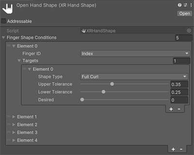
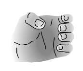
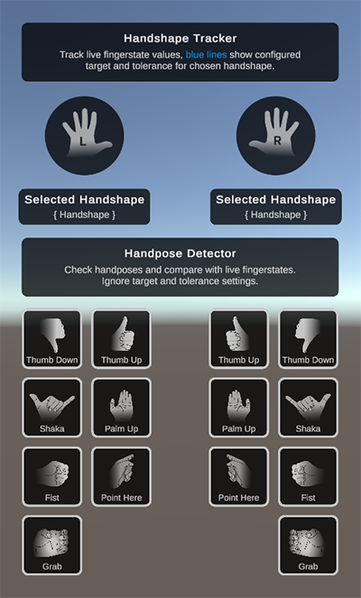

# What's new in version 1.5

Summary of changes in XR Hands package version 1.5. The main updates in this release include:

## Added

### OpenXR common hand gestures

Support for common hand gestures has been added with initial support for gestures piped through the OpenXR Hand Interaction Profile extension. This includes scripting APIs to expose **aim**, **grasp**, **grip**, **pinch**, and **poke** poses and values where appropriate for more information, please refer to the [Scripting API](https://docs.unity3d.com/Packages/com.unity.xr.hands@1.5/api/UnityEngine.XR.Hands.XRCommonHandGestures.html).

### High Fidelity Tracking Flag

The XR Hands package now enables the detection of high or low fidelity hand tracking data via `XRHandJointTrackingState.HighFidelityPose`. For OpenXR based devices, this is set if and only if a joint has its position and orientation marked as tracked by the underlying runtime. For other platforms, consult the supporting package's documentation.

## Fixed
- Fixed performance regression in hand gesture debug UI.

---

# What's new in version 1.4

Summary of changes in XR Hands package version 1.4. The main updates in this release include:

## Added

### Hand shape and static gesture detection

The XR Hands package now enables detection of static hand gestures such as thumbs up, thumbs down, or pointing. The static hand gestures are the combination of a specific hand shape with an optional orientation applied. There are some hand gestures included in the Gestures sample, along with other tools to get you started.

For additional information, refer to the [custom gesture documentation](xref:xrhands-custom-gestures).

### Upper and lower tolerance range for finger shapes

The ability to specify lower and upper tolerance limits for individual finger shapes when defining a hand shape is now available. Each finger shape behaves differently on specific fingers or hands based on various factors. Adding specific tolerance ranges increases the chances of detecting a gesture.

### Intermediate grab pose

Grab is one of the more nuanced interactions in XR. Providing an intermediate grab pose with upper and lower tolerances for the finger shapes speeds up the process for implementing grab interactions.

## Updates

### Debugging menu with prebuilt hand poses

This menu displays text-based tiles for hand poses that are now visually enhanced with drawings to illustrate the meaning of each prebuilt pose. You can still add a tile to detect your own hand pose, which will appear as a text-based tile..

### Debugging menu for individually assigned hand shapes

This menu displays live finger state values, and allows for debugging selected hand shapes. The Finger State UI elements have been rebuilt, and enhanced with support for displaying upper and lower tolerance ranges, along with additional UI changes that help to display the state of the currently detected gesture input.

 <i>The gesture debugger scene visualizing a gesture</i>

---
# What's new in version 1.3

Summary of changes in XR Hands package version 1.3.

The main updates in this release include:

## Added

- Added a root pose offset to the `XRHandSkeletonDriver` that allows an additional offset to the root pose (typically the wrist). This is useful for situations where you want the visual hand representation to stop while interacting with objects in a scene.
- Added missing sample script API documentation to make it easier to understand and build off of.

## Fixed
- Fixed documentation links for OpenXR features to point at latest documentation version.

---
# What's new in version 1.2

Summary of changes in XR Hands package version 1.2.

The main updates in this release include:

## Added
- Added `IXRHandProcessor` interface that intercepts and allows post-processing joint data before being used by other scripts. More information can be found on the [XR Hands Joint Processing](../process-joints.md) manual page.
- Added two samples to the Hand Visualizer sample for how to use the new Joint Processing feature to change the visual output of hand tracking.
- `XRHand` and `XRHandJoint` both now implement `IEquatable`, and have `Equals`, `GetHashCode`, and the `==` and `!=` operators overloaded.
- Added `XRHandTrackingEvents` component that subscribes to hand tracking events for a specific hand and surfaces Unity Events when the hand updates or tracking state changes.
- Added `XRHandMeshController` component that subscribes to events from a `XRHandTrackingEvents` and can optionally show or hide a mesh.
- Added `XRHandSkeletonDriver` component that subscribes to events from a `XRHandTrackingEvents` and updates a hierarchy of Transforms for each `XRHandJoint`.

## Changed
- Minimum supported Unity Editor version has changed to 2021.3.

## Fixed

- Fixed Hand Visualizer component so it will use another running `XRHandSubsystem` if the first is stopped.
- Fixed exception in Hand Visualizer component when a joint is invalid.
- Fixed rendering of lines that connect joints in `HandVisualizer` sample when used with the device simulator. Also removed the Origin property from the component since it was no longer used.

---
# What was new in version 1.0

Summary of changes in XR Hands package version 1.0.

The main updates in this release include:

## Added

Added subsystem for cross-platform hand-tracking and accompanying types.

Types you might care about as a user:
- `XRHandSubsystemDescriptor`, which you can retrieve a `List` of with `SubsystemManager.GetSubsystemDescriptors`.
- `XRHandSubsystem`, which can be created with a call to `Create` on the above descriptor type.
- `XRHand`, which you can retrieve from `XRHandSubsystem` with its `leftHand` and `rightHand` properties. These contain joints and `rootPose` data, as well as its `Handedness`.
- `XRHandJoint`, which you can retrieve from each `XRHand` using `GetJoint` to query for joint tracking state, pose, radius, and velocity data on a per-joint basis.
- `XRHandJointIDUtility`, which contains extension methods for certain `enum`s listed below and also houses `FromIndex`, which you can use when looping over an array to get the corresponding `XRHandJointID` (useful when calling `XRHand.GetJoint`).

As well as these `enum`s:
- `XRHandJointTrackingState`, a flags-`enum` used to denote which fields are valid and can be retrieved via their `TryGet...` methods on `XRHandJoint`.
- `XRHandJointID`, used to identify each joint, and required when accessing joint data using `XRHand.GetJoint`. If looping over an array of joint data, use `XRHandJointIDUtility.FromIndex` to convert your index to `XRHandJointID`, which is required for `XRHand.GetJoint`.
- `Handedness`, used to identify which hand is referred to by an `XRHand` using its `handedness` property.
- `XRHandFingerID`, not used anywhere else in the API surfaced in this package besides its extension methods in `XRHandJointIDUtility`: `GetFrontJointID` and `GetBackJointID`, which together provider an inclusive range for `XRHandJointID`s spanned by the finger represented by `XRHandFingerID`.

The OpenXR package must be installed and in use for these to work:
- Added OpenXR support through `HandTracking` and `OpenXRHandProvider` types.
- Added support for Meta Hand Tracking Aim extension in OpenXR through `MetaHandTrackingAim`.

Additional types you may need to interact with if writing a provider (not a common use case):
- `XRHandSubsystemProvider`, which the subsystem asks for data whenever its `TryUpdateHands` is called (built-in Unity setup calls this each frame) and is also queried when the subsystem and provider are created for which common joints are in the provider's layout using `GetHandLayout`.
- `XRHandProviderUtility`, which providers should call into using `CreateJoint` during the `TryUpdateHands` per-frame call to fill out the left- and right-hand joint arrays. This same type also has a nested `SubsystemUpdater` type to be used for automatically updating the subsystem each frame. Users can respond to updates by subscribing to the subsystem's `updatedHands` callback.

Also added a visualizer sample, which demonstrates drawing using both meshes and per-joint prefabs. You can add this sample to your project through the Samples tab of this package's view in the Package Manager window. This sample has a mesh and script that assume OpenXR layout, so it is recommended you either use that plug-in or another one that conforms to the OpenXR hand joint layout.

For a full list of changes and updates in this package, see the [XR Hands package changelog](xref:xrhands-changelog).
